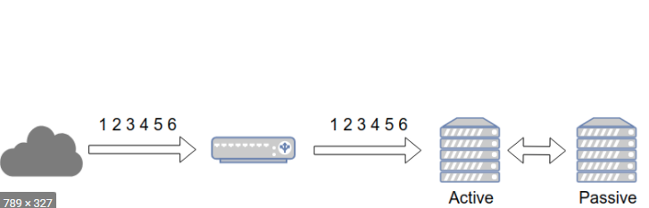
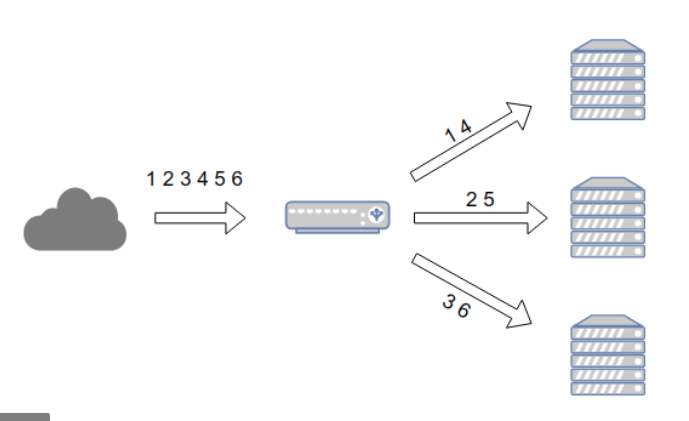
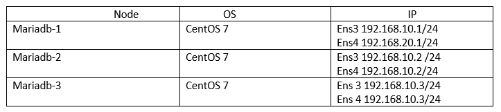
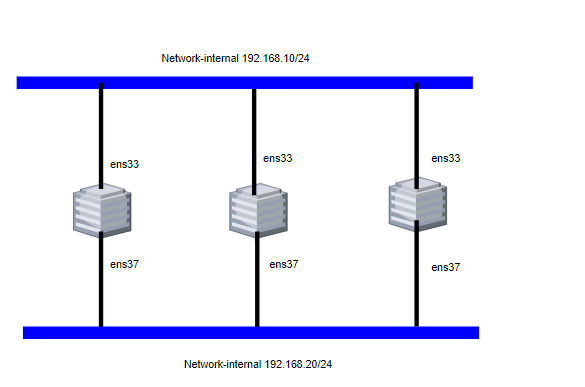

# Tìm hiểu cluster
- [Tìm hiểu cluster](#tìm-hiểu-cluster)
  - [1. Tổng quan về cluser Database](#1-tổng-quan-về-cluser-database)
    - [1.1 Cluster là gì?](#11-cluster-là-gì)
    - [1.2. Ưu điểm của Cluster](#12-ưu-điểm-của-cluster)
    - [1.3. Các chế độ hoạt động](#13-các-chế-độ-hoạt-động)
      - [1.3.1 Active - Active](#131-active---active)
      - [1.3.2 Active - Passive](#132-active---passive)
    - [1.4. Các thuật ngữ được sử dụng trong hệ thống Cluster Server](#14-các-thuật-ngữ-được-sử-dụng-trong-hệ-thống-cluster-server)
    - [1.5. Các thành phần trong Cluster](#15-các-thành-phần-trong-cluster)
  - [2. Cài đặt MariaDB Galera Cluster](#2-cài-đặt-mariadb-galera-cluster)
    - [2.1 Mô hình](#21-mô-hình)
    - [2.2 Cài đặt và cấu hình MariaDB Galera](#22-cài-đặt-và-cấu-hình-mariadb-galera)
    - [2.4 Kiểm tra hệ thống](#24-kiểm-tra-hệ-thống)
    - [2.5 TestCase Cluser DB](#25-testcase-cluser-db)
      - [2.5.1 Kiểm tra CSDL đã được đồng bộ.](#251-kiểm-tra-csdl-đã-được-đồng-bộ)
      - [2.5.2 TestCase ngắt kết nối 1 node](#252-testcase-ngắt-kết-nối-1-node)
## 1. Tổng quan về cluser Database

### 1.1 Cluster là gì?
Clustering chính là một kiến trúc được tạo ra với mục đích đảm bảo nâng cao khả năng sẵn sàng cho những hệ thống mạng.
Clustering bao gồm những server riêng lẻ được kết nối với nhau đồng thời hoạt động lại cùng nhau trong 1 hệ thống. 
Những server này giao tiếp với nhau với mục đích trao đổi thông tin và giao tiếp với cả những mạng bên ngoài
để thực hiện những yêu cầu. Trong trường hợp xảy ra lỗi thì cá dịch vụ trong Cluster hoạt động tương tác 
với nhau để duy trì độ ổn định và độ sẵn sàng cao cho hệ thống.
### 1.2. Ưu điểm của Cluster

- Cung cấp tính sẵn sàng cao

Hệ thống Server Cluster cung cấp tính luôn sẵn sàng cho các ứng dụng và các service ngay cả khi các thành phần hardware hay software bị lỗi. Khi một Server trong Cluster bị fail, 
quyền sở hữu tài nguyên của nó như là các ổ đĩa và IP address tự động chuyển tới một server khác còn hoạt động

- Cung cấp khả năng dễ mở rộng

Khi các ứng dụng trong Cluster sử dụng tài nguyên hệ thống vượt quá khả năng của nó, 
ta có thể dễ dàng add thêm node vào Cluster để đáp ứng nhu cầu truy cập hay dễ dàng thêm vào nhiều bộ xử lý 
(8 CPU cho Windows Server 2003 Enterprise Edition và 64 GB cho Datacenter Edition)

- Cung cấp sự dễ dàng trong quản lý 

Ta có thể dùng Cluster Administrator tools 
để quản lý một Cluster như là một hệ thống đơn và quản lý một ứng dụng khi chúng chạy trên một server đơn. 
Có thể di chuyển các ứng dụng giữa các server khác nhau bên trong một Cluster và 
chuyển đổi lượng công việc giữa các server hay đặt server ở trạng thái không hoạt động cho kế hoạch bảo trì 

- Hiệu suất của chi phí

Mặc dù Cluster không phải rẻ so với một máy tính duy nhất
 nhưng đối với những công việc có khối lượng công việc cao và cần sử dụng hệ thống lớn thì
  Cluster có tính hiệu quả tỷ lệ với chi phí so với những chi phí cho chi tiêu ban đầu và chắc chắn
   là rẻ hơn rất nhiều so với máy tính tổng 

### 1.3. Các chế độ hoạt động
#### 1.3.1 Active - Active



Active Active cluster được tạo ra từ ít nhất 2 node, cả 2 node chạy đồng thời xử lý cùng 1 loại dịch vụ. Mục đích chính của Active Active Cluster là tối ưu hóa cho hoạt động cân bằng tải (Load balancing). Hoạt động cân bằng tải (Load balancing) sẽ phân phối các tác vụ hệ thống tới tất cả các node bên trong cluster, tránh tình trạng các node xử lý tác vụ không cân bằng dẫn tới tình trạng quả tải. Bên cạnh đó, Active Active Cluster nâng cao thông lượng (thoughput) và thời gian phản hổi

Khuyển cáo cho chế độ Active Active Cluster là các node trong cụm cần được cấu hình giống nhau tránh tình trạng phân mảnh cụm.

#### 1.3.2 Active - Passive




Giống cấu hình Active - Active, Active Passive Cluster cần ít nhất 2 node, tuy nhiên không phải tất cả các node đều sẵn sàng xử lý yêu cầu. VD: Nếu có 2 node thì 1 node sẽ chạy ở chế độ Active, node còn lại sẽ chạy ở chế độ passive hoặc standby.

Passive Node sẽ hoạt động như 1 bản backup của Active Node. Trong trường hợp Active Node xảy ra vấn đề, Passive Node sẽ chuyển trạng thái thành active, tiếp quản xử lý các yêu cầu

### 1.4. Các thuật ngữ được sử dụng trong hệ thống Cluster Server
- Cluster

Là một hệ thống song song và được phân phối bởi một nhóm các server dành riêng để chạy những ứng dụng
 đặc biệt nào đó và kết nối với nhau để cung cấp khả năng chịu lỗi (fault tolerance) và load balance. 
 Cluster dùng để cung cấp tính luôn sẵn sàng cho việc truy cập

- Node

Là một server thuộc một Cluster nào đó 
- Failover

Quá trình failover có thể xảy ra một cách tự động.Khi một node trong Cluster bị hỏng,các resource group của nó sẽ được chuyển tới một hay nhiều node trong Cluster mà còn hoạt động được.

Các thuật ngữ được sử dụng trong hệ thống Cluster Server

- Failback

Khi một node trở lại phục vụ, Cluster trả lại quyền sở hữu tài nguyên cho nó và nó sẵn sàng để thực hiện yêu cầu

- Quorum Resource

Trong mỗi Cluster, Quorum resource chứa đựng và duy trì những thông tin cấu hình cần thiết cho việc phục hồi Cluster Resource. Các Cluster resource bao gồm các phần cứng vật lý như là các ổ đĩa,các network card và các thực thể logic như là các địa chỉ IP, các ứng dụng và cơ sở dữ liệu của ứng dụng

### 1.5. Các thành phần trong Cluster
   Trong Server Cluster, Cluster Service chạy trên mỗi node và điều khiển tất cả các hoạt động của hệ thống. Cluster Service chứa nhiều thành phần phần mềm làm việc với nhau. Chúng thực hiện nhiệm vụ theo dõi, duy trì sự ổn định, vận chuyển tài nguyên giữa các node. Cụ thế, các thành phần trong Cluster bao gồm:


- Checkpoint Manager

Để đảm bảo cho việc Cluster Service có thể phục hồi từ một resource bị lỗi, Checkpoint Manager kiểm tra các khóa registry khi một resource được mang online và ghi dữ liệu checkpoint lên quorum resource khi resource này offline

- Database Manager

Chạy trên mỗi node và duy trì một bản sao lưu cục bộ của cơ sở dữ liệu cấu hình Cluster - chứa những thông tin về những thực thể vật lý và logic trong một Cluster. Những thực thể này bao gồm bản thân Cluster, các node thành viên, các resource group, các loại resource và những mô tả của các loại resource đặc biệt là các ổ đĩa và địa chỉ IP

Database Manager cũng cung cấp một interface chứa những thay đổi trong cơ sở dữ liệu cấu hình Cluster thông qua các thành phần Cluster service khác như là Failover Manager và Node Manager. 

- Failover Manager

Quản lý các resource và các resource group. Nó chịu trách nhiệm tắt hay khởi động các resource, quản lý các resource liên quan và chuẩn bị cho một quá trình failover các resource group. Để thực hiện các hoạt động này, nó tiếp nhận resource và thông tin trạng thái hệ thống từ các thành phần Cluster trên một node và từ Resource Monitors. Resource Monitors cung cấp môi trường thực hiện cho resource DLLs và cung cấp sự giao tiếp giữa resource DLLs và Failover Manager

Failover Manager sẽ xác định node nào trong Cluster nên sở hữu Resource group. Trong trường hợp phải failover một resource group, Failover Manager trên mỗi node trong Cluster làm việc cùng nhau để tái chỉ định quyền sở hữu cho resource group đó

- Node Manager

Node Manager dùng những thông tin trong cơ sở dữ liệu cấu hình Cluster để xác định các node nào được thêm vào hay bị loại bỏ khỏi Cluster. Node Manager trên mỗi node cũng theo dõi các node khác để tìm ra node bị lỗi. 

Để thực hiện việc theo dõi, nó gửi và nhận những message gọi là các heartbeat tới mỗi node trong Cluster. Nếu một node có một sự giao tiếp bị lỗi với một node khác, nó gửi broadcast một message tới các node khác sao cho tất cả các node nhận message này để xác nhận lại danh sách các node đang hoạt động trong Cluster

- Resource Monitor

Cung cấp một interface giao tiếp giữa resource DLLs và Cluster service. Khi Cluster cần lấy dữ liệu từ một resource, Resource Monitor tiếp nhận yêu cầu và đẩy yêu cầu đó tới resource DLL thích hợp. Ngược lại, khi một resource DLL cần báo cáo trạng thái của nó hoặc thông báo cho Cluster service một sự kiện, resource đẩy thông tin này từ resource tới Cluster servic

## 2. Cài đặt MariaDB Galera Cluster

 **MariaDB Galera là gì?**

MariaDB Galera Cluster là 1 giải pháp nâng cao cho tính sẵn sàng cho MariaDB. 

- Galera Nó chỉ khả dụng trên Linux.
- Hỗ trợ chế độ Active-Active. 
- Một node có thể được thêm vào cluster cũng như gỡ ra khỏi cluster mà không có downtime dịch vụ

### 2.1 Mô hình




**IP planning**




### 2.2 Cài đặt và cấu hình MariaDB Galera

Thực hiện trên cả lần lượt trên  3 node
**Bước 1** : Cấu hình Hostname

hostnamectl set-hostname node1

```
echo "192.168.10.128 node1" >> /etc/hosts
echo "192.168.10.129 node2" >> /etc/hosts
echo "192.168.10.130 node3" >> /etc/hosts
```

**Bước 2**: Cài đặt Epel repository và Update các gói cài đặt

```
yum -y install epel-release
yum -y update
```

**Bước 3** : Cài đặt các gói hỗ trợ

```
yum -y install git wget vim
```

**Bước 4** : Cài đặt các gói Galera
```
yum -y install mariadb-server-galera galera rsync python3-PyMySQL
```

**Bước 5** : Tắt firewall, Selinux

```
sed -i 's/SELINUX=enforcing/SELINUX=disabled/g' /etc/sysconfig/selinux
sed -i 's/SELINUX=enforcing/SELINUX=disabled/g' /etc/selinux/config
systemctl disable --now firewalld
```

**Bước 6** : Khởi động lại máy để load được cấu hình selinux

```reboot```


**Thực hiện trên node-1**


**Bước 1** : Cấu hình Galera tại node-1

```
cp /etc/my.cnf.d/server.cnf /etc/my.cnf.d/server.cnf.bak

cat > /etc/my.cnf.d/server.cnf << EOF
[server]
[mysqld]

[galera]
wsrep_on=ON
wsrep_provider=/usr/lib64/galera/libgalera_smm.so
#add your node ips here
wsrep_cluster_address="gcomm://192.168.10.128,192.168.10.129,192.168.10.130"
binlog_format=row
default_storage_engine=InnoDB
innodb_autoinc_lock_mode=2
#Cluster name
wsrep_cluster_name="tuan_cluster"
#this server ip, change for each server
wsrep_node_address="192.168.10.128"
#this server name, change for each server
wsrep_node_name="node1"
wsrep_sst_method=rsync
[embedded]
[mariadb]
[mariadb-10.2]
EOF
```

**Thực hiện trên node-2**

Cấu hình Galera tại node mariadb-2

```
cp /etc/my.cnf.d/server.cnf /etc/my.cnf.d/server.cnf.bak

cat > /etc/my.cnf.d/server.cnf << EOF
[server]
[mysqld]

[galera]
wsrep_on=ON
wsrep_provider=/usr/lib64/galera/libgalera_smm.so
#add your node ips here
wsrep_cluster_address="gcomm://192.168.10.128,192.168.10.129,192.168.10.130"
binlog_format=row
default_storage_engine=InnoDB
innodb_autoinc_lock_mode=2
#Cluster name
wsrep_cluster_name="tuan_cluster"
# this server ip, change for each server
wsrep_node_address="192.168.10.129"
# this server name, change for each server
wsrep_node_name="node2"
wsrep_sst_method=rsync
[embedded]
[mariadb]
[mariadb-10.2]
EOF
```

**Thực hiện trên node-3**

```
cp /etc/my.cnf.d/server.cnf /etc/my.cnf.d/server.cnf.bak

cat > /etc/my.cnf.d/server.cnf << EOF
[server]
[mysqld]

[galera]
wsrep_on=ON
wsrep_provider=/usr/lib64/galera/libgalera_smm.so
#add your node ips here
wsrep_cluster_address="gcomm://192.168.10.128,192.168.10.129,192.168.10.130"
binlog_format=row
default_storage_engine=InnoDB
innodb_autoinc_lock_mode=2
#Cluster name
wsrep_cluster_name="tuan_cluster"
#this server ip, change for each server
wsrep_node_address="192.168.10.130"
#this server name, change for each server
wsrep_node_name="node3"
wsrep_sst_method=rsync
[embedded]
[mariadb]
[mariadb-10.2]
EOF
```


**Thực hiện tại node-1**

Ta sẽ dùng node mariadb-1 làm node khởi tạo Galera cluster ( Tức là các node khác sẽ đồng bộ dữ liệu từ mariadb-1 )

Ta thực hiện khởi tạo tại node-1

```
galera_new_cluster
systemctl enable mariadb
```

Khởi động dịch vụ MariaDB tại 2 node-2 và node-3

```
systemctl start mariadb
systemctl enable mariadb
```

### 2.4 Kiểm tra hệ thống

Kiểm tra số node thuộc cluster
```
mysql -u root -e "SHOW STATUS LIKE 'wsrep_cluster_size'"
```

Kết quả
```
[root@node1 ~]# mysql -u root -e "SHOW STATUS LIKE 'wsrep_cluster_size'"
```
```
+--------------------+-------+
| Variable_name      | Value |
+--------------------+-------+
| wsrep_cluster_size | 3     |
+--------------------+-------+
```


kiểm tra các thành viên thuộc cluster

```
[root@node1 ~]# mysql -u root -e "SHOW STATUS LIKE 'wsrep_incoming_addresses'"
```

```
+--------------------------+-------------------------------------------------------------+
| Variable_name            | Value                                                       |
+--------------------------+-------------------------------------------------------------+
| wsrep_incoming_addresses | 192.168.10.128:3306,192.168.10.129:3306,192.168.10.130:3306 |
+--------------------------+-------------------------------------------------------------+
```


### 2.5 TestCase Cluser DB


#### 2.5.1 Kiểm tra CSDL đã được đồng bộ.


***Tạo bảng kiểm tra tính đồng bộ trên các Node***

Tạo 1 bảng và chèn dữ liệu vào đó. Sử dụng node1 để nhập vào các câu lệnh sau
- Tạo database:
  

```
create database Test;
```

- Tạo bảng:

```
use Test;
CREATE TABLE IF NOT EXISTS hocsinh(
    sv_id INT(11) NOT NULL AUTO_INCREMENT,
    sv_name VARCHAR(255) NOT NULL,
    sv_description  VARCHAR(500),
    CONSTRAINT pk_hocsinh PRIMARY KEY(sv_id)
) ENGINE = INNODB;
```


***Kiểm tra trên các node 2,3***

```
mysql -u root

MariaDB [(none)]> show databases;
+--------------------+
| Database           |
+--------------------+
| information_schema |
| mysql              |
| performance_schema |
| Test              |
+--------------------
4 rows in set (0.09 sec)

MariaDB [(none)]> use Test;
Reading table information for completion of table and column names
You can turn off this feature to get a quicker startup with -A

Database changed

MariaDB [Test]> show tables;
+----------------+
| Tables_in_Test |
+----------------+
| Hosinh       |
+----------------+
1 row in set (0.00 sec)
```

Dữ liệu được nhập vào ***node2*** đã được sao chép vào ***node2***. 


#### 2.5.2 TestCase ngắt kết nối 1 node

 Sau đó tiếp tục insert vào bảng ***hocsinh*** trên ***node2***
```
MariaDB [vidu]> INSERT INTO hosinh(sv_name, sv_description)
    -> VALUES('Mr Hieu', 'Do Minh Hieu');
Query OK, 1 row affected (0.00 sec)

MariaDB [vidu]> INSERT INTO hocsinh(sv_name, sv_description)
    -> VALUES('TuanNguyen3', 'Nguyen Ngoc Tuan3');
Query OK, 1 row affected (0.00 sec)
```

- Kết quả sau khi nhập:
```
MariaDB [Test]> SELECT * FROM hocsinh;
+-------+-------------+---------------------+
| sv_id |   sv_name   |   sv_description    |
+-------+-------------+---------------------+
|     1 | TuanNguyen1 | Nguyen Ngoc Tuan1   |
|     2 | TuanNguyen2 | Nguyen Ngoc Tuan2   |
|     3 | TuanNguyen3 | Nguyen Ngoc Tuan3   |
+-------+---------+-------------------------+
4 rows in set (0.00 sec)

```

***Tiến hành bật lại node3 vừa tắt, kiểm tra:***

```
[root@node3 ~]# mysql -u root -p
Enter password:
Welcome to the MariaDB monitor.  Commands end with ; or \g.
Your MariaDB connection id is 10
Server version: 10.2.41-MariaDB-log MariaDB Server

Copyright (c) 2000, 2018, Oracle, MariaDB Corporation Ab and others.

Type 'help;' or '\h' for help. Type '\c' to clear the current input statement.

MariaDB [(none)]> show databases;
+--------------------+
| Database           |
+--------------------+
| information_schema |
| mysql              |
| performance_schema |
| Test              |
+--------------------+
4 rows in set (0.01 sec)

MariaDB [(none)]> use Test;
Reading table information for completion of table and column names
You can turn off this feature to get a quicker startup with -A

Database changed
MariaDB [Test]> show tables;
+----------------+
| Tables_in_Test |
+----------------+
| Hocsinh        |
+----------------+
1 row in set (0.00 sec)

MariaDB [Test]> SELECT * FROM hocsinh;
+-------+-------------+---------------------+
| sv_id |   sv_name   |   sv_description    |
+-------+-------------+---------------------+
|     1 | TuanNguyen1 | Nguyen Ngoc Tuan1   |
|     2 | TuanNguyen2 | Nguyen Ngoc Tuan2   |
|     3 | TuanNguyen3 | Nguyen Ngoc Tuan3   |
+-------+---------+-------------------------+
4 rows in set (0.00 sec)
```

***Kết quả : Trên node3 dữ liệu đã được đồng bộ.***