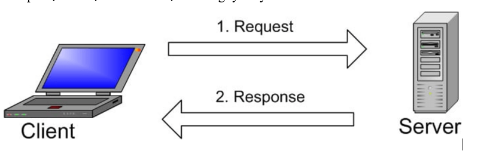

- [1. Tìm hiểu MySQL](#1-tìm-hiểu-mysql)
  - [1.1 MySQL là gì ?](#11-mysql-là-gì-)
  - [1.2. Các thuật ngữ thường gặp cơ bản của MySQL](#12-các-thuật-ngữ-thường-gặp-cơ-bản-của-mysql)
    - [1.2.1 Mã nguồn mở?](#121-mã-nguồn-mở)
    - [1.2.2 Clinet-server](#122-clinet-server)
  - [1.3 Sự khác biệt của SQL và MySQL](#13-sự-khác-biệt-của-sql-và-mysql)
  - [1.4.Cách thức hoạt động của MySQL](#14cách-thức-hoạt-động-của-mysql)
  - [1.5. Ưu điểm nổi bật của MySQL](#15-ưu-điểm-nổi-bật-của-mysql)
- [2. Tìm hiểu MariaDB](#2-tìm-hiểu-mariadb)
  - [2.1 Khái niệm ?](#21-khái-niệm-)
  - [2.2 Ưu điểm khi sử dụng MariaDB là gì?](#22-ưu-điểm-khi-sử-dụng-mariadb-là-gì)
  - [2.3 Lịch sử của MariaDB](#23-lịch-sử-của-mariadb)
  - [2.4 Mối quan hệ giữa MariaDB và MySQL](#24-mối-quan-hệ-giữa-mariadb-và-mysql)
  - [2.5. Ưu điểm của MariaDB là gì?](#25-ưu-điểm-của-mariadb-là-gì)
- [So sánh giữa MySQL và MariaDB](#so-sánh-giữa-mysql-và-mariadb)
## 1. Tìm hiểu MySQL
### 1.1 MySQL là gì ?
MySQL chính là hệ quản trị cơ sở dữ liệu mã nguồn mở Relational Database Management System – RDBMS hiện nay được sử dụng phổ biến trên phạm vi toàn cầu. Hệ quản trị cơ sở dữ liệu này hoạt động dựa trên mô hình tiêu chuẩn là Client (Máy khách) – Server (Máy chủ).
### 1.2. Các thuật ngữ thường gặp cơ bản của MySQL
#### 1.2.1 Mã nguồn mở?
Bản chất của MySQL là hệ thống mã nguồn mở nên bất kì ai cũng có thể tải xuống, sử dụng, hay tiến hành chỉnh sửa theo ý muốn.
#### 1.2.2 Clinet-server
- Mô hình này giống như một mạng nhện mà ở đó có máy chủ – server sẽ được đặt nằm ở vị trí trung tâm, có nhiệm vụ chủ yếu là lưu trữ các dữ liệu trên hệ thống. Trong khi đó những máy khách - client khi cần tìm kiếm, hay làm việc với một dữ liệu cụ thể sẽ kết nối với máy chủ để được cung cấp thông tin theo nhu cầu.
  
- MySQL Client
Khái niệm này được hiểu là máy khách trên hệ thống MySQL . Chỉ cần có phần mềm mà ở đó cho phép kết nối, cũng như nhận phản hồi của máy chủ MySQL.

- MySQL Server
MySQL Server chính là máy chủ cài và sử dụng cách lưu trữ các dữ liệu thông qua hệ thống MySQL Server được đánh giá cao nhờ khả năng bảo mật tốt, đồng thời cũng có tốc độ xử lý nhanh chóng.

### 1.3 Sự khác biệt của SQL và MySQL
- MySQL chỉ là một trong những hệ thống quản trị dữ liệu 
- SQL chính là ngôn ngữ được sử dụng để liên lạc giữa máy chủ và máy khách trên một hệ thống cụ thể.

- Hành động của SQL thông thường sẽ được sử dụng để thực hiện những nhiệm vụ như:
    - Data Query: tức là yêu cầu lấy một thông tin cụ thể nào đó từ kho dữ liệu lưu trữ sẵn.
    - Data Manipulation: thực hiện việc thêm, sửa, hay xóa ,… các dữ liệu theo yêu cầu.
    - Data Indentiny: giúp định nghĩa một dữ liệu cụ thể thuộc loại nào, được phân chia vào ngăn tủ nào trong database.
   - Data Access Control: giúp cung cấp hoặc giới hạn quyền truy cập của một ai đó, từ đó việc bảo vệ an toàn, bảo mật cho dữ liệu sẽ được tiến hành hiệu quả.
 - 
### 1.4.Cách thức hoạt động của MySQL
Trong môi trường MySQL thì máy khách và máy chủ sẽ hoạt động với sự tương tác qua lại liên tục với nhau dựa trên nguyên lý chính là:

- MySQL sẽ tạo ra một bảng giúp việc lưu trữ dữ liệu, cũng như định nghĩa được mối quan hệ giữa các bảng được thực hiện đầy đủ, chi tiết và chính xác,
- Máy khách sẽ gửi những yêu cầu SQL thông qua lệch đặc biệt lên MySQL.
- Những ứng dụng trên máy chủ lúc này sẽ nhận được và đưa ra phản hồi thông tin, từ đó trả kết quả trực tiếp về máy khách.
### 1.5. Ưu điểm nổi bật của MySQL

   - Độ bảo mật cao
Sở hữu mức độ bảo mật cao giúp MySQL khó có thể bị các hacker tấn công, đảm bảo an toàn cho hoạt động của mỗi website. Bởi thế, việc quản trị dữ liệu cho các web lớn hay nhỏ, với lượng dữ liệu nhiều hay ít đều được hỗ trợ với mức độ an toàn lý tưởng.

-	Tốc độ nhanh chóng
Một ưu điểm không thể thiếu khi đánh giá về MySQL chính là tốc độ nhanh chóng, ấn tượng khi sử dụng. Với tốc độ truy vấn, cũng như khả năng phản hồi dữ liệu ấn tượng thì việc sử dụng MySQL luôn được đánh giá cao, trở thành lựa chọn lý tưởng để nâng cao hiệu quả công việc.
-	Dễ dàng sử dụng
Việc sử dụng MySQL trực quan, đơn giản và dễ dàng. Bởi thế, nó thích hợp với mọi đối tượng người dùng dù có kiến thức liên quan chuyên sâu tới đâu. Dù là người mới, hay có kinh nghiệm đều có thể ứng dụng MySQL hiệu quả để hỗ trợ tốt cho yêu cầu, cho những đòi hỏi thực tế trong công việc.
-	Dễ dàng mở rộng
Là một mã nguồn mở giúp hệ quản trị dữ liệu MySQL khi sử dụng đảm bảo dễ dàng phát triển, mở rộng để đáp ứng tốt cho nhu cầu sử dụng thực tế của con người. Với yêu cầu đa dạng, ngày càng phức tạp trong phát triển và duy trì hoạt động của website thì MySQL với việc dễ dàng mở rộng mang lại sự chủ động trong công việc.
-	Hoàn toàn miễn phí
Với hệ quản trị dữ liệu MySQL khi đưa vào sử dụng giúp người dùng có khả năng tiết kiệm chi phí hiệu quả. Hoàn toàn miễn phí cũng làm nên ưu điểm, lợi ích cho người dùng khi lựa chọn MySQL để đáp ứng cho nhu cầu của chính mình. Đây cũng là lý do mà nó được tin tưởng sự dụng, được nhiều lập trình viên ưa chuộng chọn lựa.
## 2. Tìm hiểu MariaDB 
### 2.1 Khái niệm ?
- MariaDB là hệ quản trị cơ sở dữ liệu miễn phí được phát triển từ hệ quản trị cơ sở dữ liệu mã nguồn mở MySQL. MariaDB được phát triển nhằm thay thế công nghệ cơ sở dữ liệu MySQL, vì thế nó tương thích và cho một hiệu suất cao hơn so với MySQL. 
 ### 2.2 Ưu điểm khi sử dụng MariaDB là gì?

- MariaDB là một hệ quản trị cơ sở dữ liệu mã nguồn mở được nhiều chuyên gia đánh giá cao
- MariaDB được Michael “Monty” Widenius, developer hàng đầu của MySQL dẫn dắt và phát triển. Ưu điểm lớn nhất của hệ quản trị này là tương thích với nhiều hệ điều hành, bao gồm Linux CentOS, Ubuntu và Window với các gói cài đặt tar, zip, MSI, rpm cho cả 32bit và 64bit với hiệu suất cao hơn so với MySQL. 
  
-Vì thế, MariaDB đang ngày càng được đông đảo các nhà phát triển sử dụng, trong đó có wikipedia, Fullstack-Station,… MariaDB đang có xu hướng thay thế cho MySQL – hệ quản trị cơ sở dữ liệu mã nguồn mở lâu đời nhất được sử dụng từ trước đến nay.

### 2.3 Lịch sử của MariaDB
- MariaDB được hình thành dựa trên nền tảng của MySQL
  
- Nền móng cơ sở đầu tiên của MariaDB được phát triển bởi “trụ cột” của MySQL AB là Michael “Monty” Widenius.
-  Năm 2008, sau khi Sun mua lại MySQL AB, Michael “Monty” Widenius rời khỏi MySQL AB và tiếp tục phát triển một hệ cơ sở quản trị mới của mình.
  
- Đầu năm 2009, Michael cùng với 1 vài đồng nghiệp khác bắt đầu tiến hành dự án chuyên sâu về công cụ lưu trữ MySQL, sau này trở thành MariaDB. Tên gọi MariaDB được đặt tên theo tên con gái út của Widenius – Maria.

-  Sau nhiều lần nâng cấp và phát triển, hiện tại MariaDB đã ra mắt phiên bản mới nhất là MariaDB 10.1.
### 2.4 Mối quan hệ giữa MariaDB và MySQL

- MariaDB là hệ thống quản trị cơ sở dữ liệu mã nguồn mở, có thể sử dụng miễn phí MariaDB được hình thành dựa trên nền tảng của MySQL, vì thế nó kế thừa được hầu hết các chức năng cơ bản cần thiết của MySQL. Bên cạnh đó, MariaDB cũng phát triển thêm nhiều tính năng mới và có sự nâng cấp hơn về cơ chế lưu trữ, tối ưu máy chủ.
- MariaDB có 2 bản trả phí và không cần trả phí. Tuy nhiên, với phiên bản không trả phí, người dùng vẫn có thể sử dụng đầy đủ các tính năng mà không ảnh hưởng đến việc chạy hệ thống.

### 2.5. Ưu điểm của MariaDB là gì?

Những ưu điểm lớn nhất của hệ quản trị này phải kể đến bao gồm:

-
- Hoàn toàn miễn phí
  - Đây là một hệ quản trị sử dụng mã nguồn mở hoàn toàn miễn phí. Do đó, người dùng không cần phải bỏ tiền mua bản quyền và vẫn có thể sử dụng đầy đủ những tính năng của phần mềm này.
- Khắc phục những hạn chế của MySQL
  - MariaDB được phát triển từ MySQL, do đó nó kế thừa những đặc điểm chủ yếu của hệ quản trị này từ phiên bản 5.1 -> 5.5.
  -  Những hạn chế của MySQL, khi chuyển qua MariaDB đều sẽ được khắc phục.
  -  tốc độ hơn so với MySQL . 
  -   Ngoài ra, hệ quản trị này còn cải thiện hiệu năng và có thêm nhiều chức năng mới hơn so với MySQL.

- Kết hợp cả SQL và NoSQL
  
    - MariaDB là sự kết hợp của cả 2 loại cơ sở dữ liệu là SQL và NoSQL( dành cho các kho dữ liệu phân tán với nhu cầu lưu trữ dữ liệu lớn). Việc kết hợp sẽ giúp hệ thống này có thể tích hợp được tất cả ưu điểm của cả 2 cơ sở dữ liệu này là Dynamic Column và Cassandra Storage Engine.
-  Hỗ trợ tiếng Việt

## So sánh giữa MySQL và MariaDB
2 hệ thống này cũng có những điểm khác biệt như sau:
- Về cơ sở hình thành
- Ngôn ngữ lập trình hỗ trợ
- Công cụ lưu trữ

- Về cơ sở hình thành
Sự khác biệt trong cơ sở hình thành với MariaDB là gì? MySQL được hình thành từ năm 1995 dựa trên cơ sở của C / C ++, và hiện tại được duy trì và phát triển bởi đội ngũ Oracle.
Phiên bản đầu tiên của MariaDB ra mắt vào năm 2009, được phát triển trên nền tảng MySQL và thừa kế những ưu điểm của MySQL.
Theo số liệu thống kê, trong số các hệ thống quản trị cơ sở dữ liệu, MySQL xếp ở vị trí thứ 2 trong khi MariaDB xếp ở vị trí thứ 9.

- Ngôn ngữ lập trình hỗ trợ
MySQL: Ada, C, C#, C++, D, Delphi, Eiffel, Erlang, Haskell, Java, JavaScript (Node.js), Objective-C, OCaml, Perl, PHP, Python, Ruby, Scheme, Tcl
MariaDB: Cũng tương tự MySQL nhưng không hỗ trợ Delphi

- Công cụ lưu trữ
MySQL sẽ bao gồm các công cụ lưu trữ sau: InnoDB, MyISAM, BLACKHOLE, CSV, MEMORY, ARCHIVE, MERGE.
MariaDB bao gồm: InnoDB, MyISAM, BLACKHOLE, CSV, MEMORY, ARCHIVE, MERGE, ColumnStore, MyRocks, Aria, SphinxSE, TokuDB, CONNECT, SEQUENCE, Spider, Cassandra.

